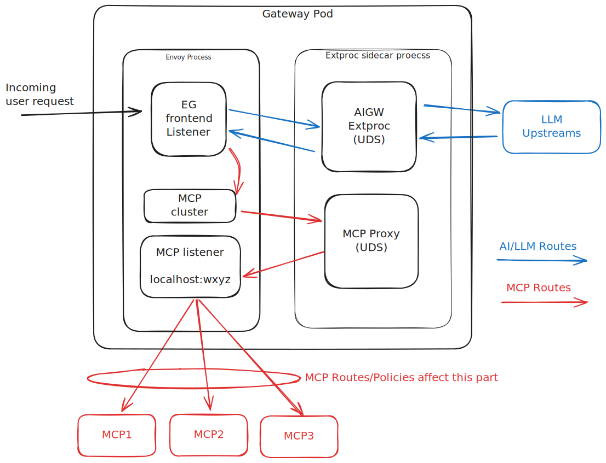

# Spike: Using 'aigw' for MCP features behind Istio

## Approach

* Install Istio locally in a simple Kubernetes setup.
* Deploy the standalone aigw binary as a service.
* Configure Istio routing so /mcp/* traffic is sent to the aigw service.
* Add one or more MCP servers to aigw (local and/or external).
* Test MCP interactions through the Istio gateway using MCP Inspector or Claude.
* Note what works and where it breaks — protocol, auth w/ kuadrant, notifications, etc.

## Outcomes

* Determine feasibility of using aigw behind Istio for MCP gateway functionality.
    * In particular, can [kuadrant AuthPolicy](https://docs.kuadrant.io/1.3.x/kuadrant-operator/doc/overviews/auth/) be used similar to existing [kagenti/mcp-gateway auth examples](https://github.com/kagenti/mcp-gateway/blob/main/docs/design/auth-phase-1.md).
* Gain a clearer understanding of Envoy AI Gateway’s architecture and integration points.
    * What pieces are potentially reusable at the envoy layer
* Identify key limitations and potential gaps (e.g., missing features or lifecycle management & control plane needs) for Istio compatibility.
    * What does [kagenti/mcp-gateway](https://github.com/kagenti/mcp-gateway/tree/main/docs) do/have that this doesn’t, and vice versa?

From an architecture point of view, one of the goals of this spike is to enable the 'red arrows path' in this diagram with Istio,
likely through EnvoyFilter, injection templates, or a mutation webhook.

